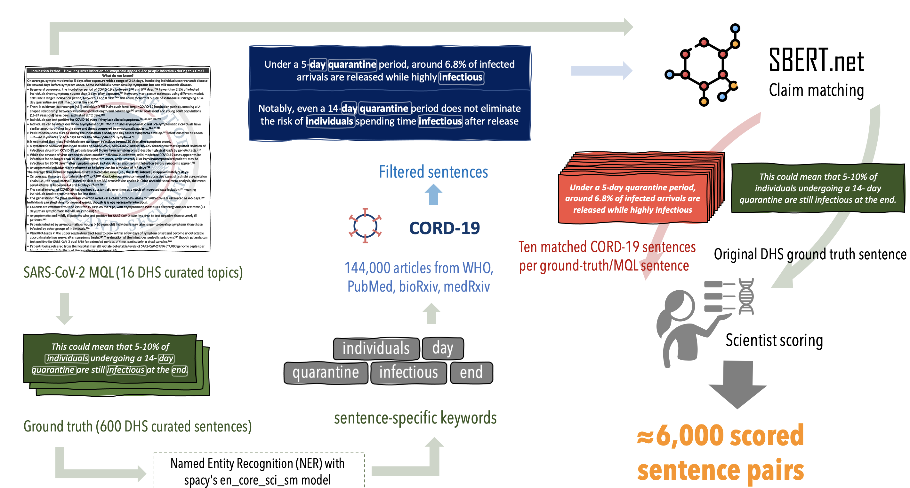
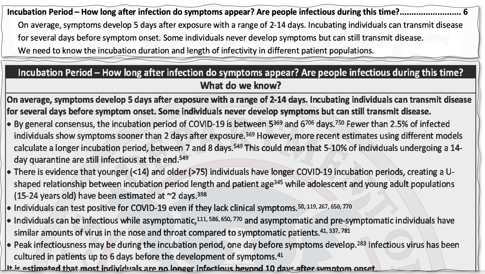
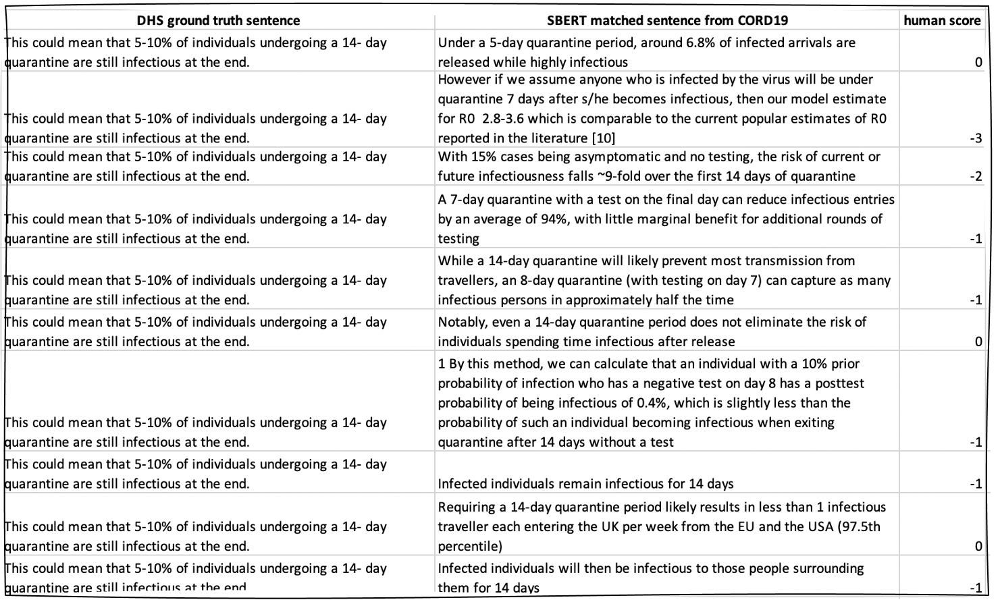
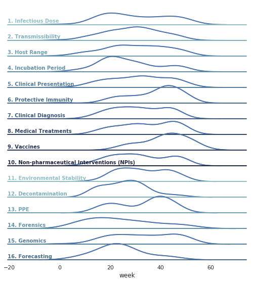
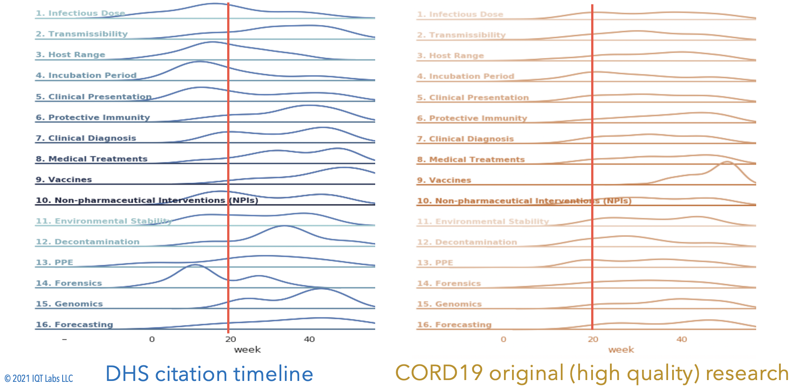
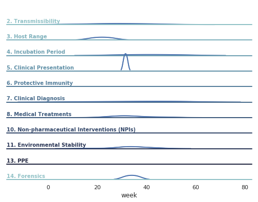
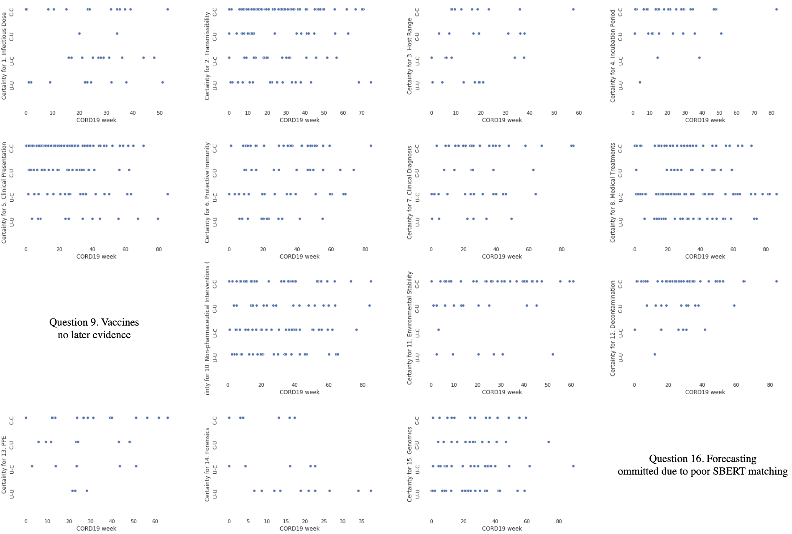

# HindSight2020

## Intro

This codebase matches sentences between two corpora of COVID-19 academic articles (or their summaries).

We use this approach to claim-match a [human-curated set of COVID-19 research results](https://www.dhs.gov/publication/st-master-question-list-covid-19) (corpus1, DHS) against [over a hundred thousand academic articles on COVID-19](https://www.ncbi.nlm.nih.gov/pmc/articles/PMC7251955/) (corpus2, CORD-19-AllenAI) to trace the evolution of research for emerging infectious disease (EID) outbreaks. Specifically, we examine the stability around early evidence in the course of the pandemic, and therefore, the feasibility and timelines of using early research conclusions for policy-making EIDs.

For more details, see our [Hindsight2020 paper -- TBA](http://FIXME).

## Abstract

We apply claim-matching to various subsets of the COVID-19 scientific literature. Our goal is to build a framework for characterizing uncertainty in EID outbreaks as a function of time, peer review, hypothesis-sharing, evidence collection practice, and interdisciplinary citation networks. In the healthiest of times, scientists face validity, methodology, and reproducibility challenges; following EIDs, the rush to publish and the risk of data misrepresentation, misinterpretation or worse misinformation puts an even greater onus on methodological rigor and proper understanding of the scientific method, which includes revisiting initial assumptions. This project seeks to understand how and when early evidence emerges for different types of recurring EID questions, outlined below, via a deep learning approach using SBERT for claim matching. In addition, it makes publicly available an expert-annotated dataset of 5,815 matched sentence pairs that can be used to fine-tune future COVID-19 natural language programming models.

## HindSight2020 Setup
1. Navigate to the repository root directory in your terminal.
2. Create a new virtual environment with:
`python3 -m venv hindsightEnv` 
3. Activate the virtual environment with:
`source hindsightEnv/bin/activate`
4. Install the requrired packages with:
`pip install -r requirements.txt`
5. Run the setup script with:
`python hindsight/setup.py`

## Quick start: Running HindSight2020 Claim Matcher using SBERT
We use a pre-trained SBERT model to efficiently compare pairs of sentences; our DHS search dataset contains about 600 ground-truth claims, which we are able to match against 7 million sentences from the CORD-19 candidate dataset within less than 24 hours using this approach. You can verify correct installation by executing the commands below:

1. Navigate to your repository root.
2. Modify the `./config/config.yml` file for the setup you would like to run (repo works with defaults there).
3. Activate the virtual environment from the setup above.
4. Run `time python hindsight/main.py -s 'manual' -c 'cord19_json'` from your repository root. This will extract the sentences from the
CORD-19 dataset of json files, and claim-match them against the DHS ground truth evidence contained in `./config/config.yml`. 

Conceptually, this codebase is performing the actions below:

## HindSight2020 Pre-processing steps
If you want to perform a different analysis than the default in `./config/config.yml`, you'll need to prepare all of the files referenced in that configuration file. Below is a summary of those components, along with the scripts in this repo which can be used to generate the required files.

### Setting up the CORD-19 candidate document set of academic articles
The [CORD-19 dataset](https://allenai.org/data/cord-19) is a publicly-available dataset of COVID-19 academic articles and related research
that is updated daily/weekly, and made available in json format. We rely on some of the fields present in these json files (such as abstract, date, paperID, etc) to perform our processing in `cord19_json_loader.py`; you can modify this file to conform to any json fields you'd like to read in. To use this dataset or one like it, specify the following fields in `./config/config.yml`:
1. `CORD-19_dir`: the path to json files, one for each CORD-19 paper
2. `metadata_path`: the path to the metadata csv that comes with a CORD-19 download

### Setting up the DHS search document set of ground-truth evidence
We perform our claim matching against sentences provided by [DHS' weekly updates on COVID-19](https://www.dhs.gov/publication/st-master-question-list-covid-19); we manually converted this pdf into text documents that contain the sentences of evidence DHS cites for one of 16 Master Questions about COVID-19:

|&numero;|Category|MQs|
|--|:--|:--|
|1|Infectious Dose|How much agent will make a healthy individual ill?|
|2|Transmissibility|How does it spread from one host to another? How easily is it spread?|
|3|Host Range|How many species does it infect? Can it transfer from species to species?|
|4|Incubation Period|How long after infection do symptoms appear? Are people infectious during this time?|
|5|Clinical Presentation|What are the signs and symptoms of an infected person?|
|6|Protective Immunity|How long does the immune response provide protection from reinfection?|
|7|Clinical Diagnosis|Are there tools to diagnose infected individuals? When during infection are they effective?|
|8|Medical Treatments|Are there effective treatments?|
|9|Vaccines|Are there effective vaccines?|
|10|Non-Pharma. Interventions|Are public health control measures effective at reducing spread?|
|11|Environmental Stability|How long does the agent live in the environment?|
|12|Decontamination|What are effective methods to kill the agent in the environment?|
|13|PPE|What PPE is effective, and who should be using it?|
|14|Forensics|Natural vs intentional use? Tests to be used for attribution.|
|15|Genomics|How does the disease agent compare to previous strains?|
|16|Forecasting|What forecasting models and methods exist?|

An example snippet of the DHS pdf is as follows:

These sentences are placed into `DHS_raw.txt`, with one sentence per line, a `#` separator, followed by a comma-separated list of reference
numbers.

We also converted the list of citations from this DHS document into another text file.

Then, we then performed the following pre-processing steps to prepare this dataset for claim matching against the CORD-19 dataset:

#### 1. Reformat DHS sentence to yaml file format
We run `DHS_to_manual.py` to convert `DHS_raw.txt` into `DHS_processed.txt`, the contents of which we manually copy into the bottom of the
`./config/config.yml` file to perform claim matching against. There are about 600 such sentences from DHS. This file is also used elsewhere in the 
pipeline. Specify the paths in `config.yml`:
`DHS_path: hindsight/DHS_processed.txt`
`DHS_raw_path: hindsight/DHS_raw.txt`

#### 2. Mine keywords from each sentence using NER
We run `NER.py` on `DHS_raw.txt` to obtain keywords for each sentence, stored in `DHS_NERs.txt`. Convert to a csv and specify the paths in the 
`./config/config.yml`:
`DHS_citations_path: hindsight/DHS_NERs.csv`

#### 3. Manually collect DHS citations
We copied the numbered citations from the DHS pdf into a text file, specified in `./config/config.yml`:
`DHS_citations_path: hindsight/DHS_citations.txt`

#### 4. Specify the remaining paths in `./config/config.yml`
`output_dir: hindsight/matched_claims/ # path to where matched outputs are written for debugging`
`results_csv_path: hindsight/results.txt # path to where results are stored`
`skipped_path: hindsight/skipped.txt # path to where error-generating DHS sentences are stored, for debugging`

## Running the SBERT Claim Matching on DHS evidence against the CORD-19 datset
After completing the installation and preprocessing steps above, you can run the claim matcher with:
`time python hindsight/main.py -s 'manual' -c 'cord19_json'` 
from your repository root. This will extract the sentences from the
CORD-19 dataset of json files, and claim-match them against the DHS ground truth evidence contained in `./config/config.yml`. 

## Manually processing SBERT-matched claims
Once you run the code to generate potential matches for the DHS evidence sentences, you will want to manually examine these matches. 

In our experiment, selecting the top ten best matches for each DHS sentence led to about 6,000 sentence pairs which we manually annotated on a 0 to 3 scale for their "spiritual similarity" as research conclusions/evidence pairs.

Please note:
> We rank sentence similarity in terms of how closely-aligned two sentences are from the standpoint of research claim-matching: that is, if we wanted to find which papers contained sentences _similar in spirit_ to the original evidence, that is: statements describing the same phenomenon _even if they arrived at opposing research conclusions_. These ratings do not necessarily overlap with traditional STS scoring, as whether or not two sentences are "very similar" as, in some sense, many/most sentences would be similar at a very high level of abstraction given that they all pertain to COVID-19. Similarly, our approach takes into account seemingly unrelated annotations in our dataset which may still be discussing the same topic or sub-topic.

An example snippet of our annotations of sentence pairs is as follows:

Our 5,800 annotated pairs are available in the `paper_results` folder of this repo.

## Analysis for paper 
We provide a jupyter notebook for generating the analyses and images for our paper in the `./hindsight/paper_results/` directory. 

These analyses can be used to generate graphs of the patterns of evidence for different MQL questions over time:

As another example, we can compare the DHS evidence against the CORD19 evidence over time:

Our 5,800 annotated pairs, are available in the `paper_results` folder of this repo as `./hindsight/paper_results/hindsight_results_combined_citations_DHSdates.csv`.

## Measuring Entailment/Contradiction
To measure entailment, we prepared an `inputs.txt` file of sentence pairs to be fed into the [MedNLI](https://github.com/jgc128/mednli) tool by Romanov et al.
After cloning that repo, it can be run on our dataset as:
`python predict.py data/models/mednli.infersent.glovebioasqmimic.128.n8d0l13c.pkl data/inputs.txt data/predictions_test.csv`

Such an analysis can be used to generate a graph of the contradictions over time:

Our 5,800 annotated pairs, along with their human-verified contradiction scores, are available in the `paper_results` folder of this repo.

## Measuring Certainty/Uncertainty
Similarly, we measured how certainty between two matched sentence pairs evolved over time using the [LUCI](https://github.com/meyersbs/uncertainty/wiki) tool by Vincze. Once you clone that repo, you can run the tool on the `inputs.txt` you prepared in the previous step by running our `uncertainty.py` script in their root directory.

Such an analysis can be used to generate a graph of the change in uncertainty over time:

Our 5,800 annotated pairs, along with their uncertainty evolution scores, are available in the `paper_results` folder of this repo.

## Acknowledgements

Thanks to Ben Rocklin et al. for IQTLab's [Infodemic Claim-Matching](https://github.com/IQTLabs/ClaimMatching) codebase, which provided useful claim-matching code using SBERT.
